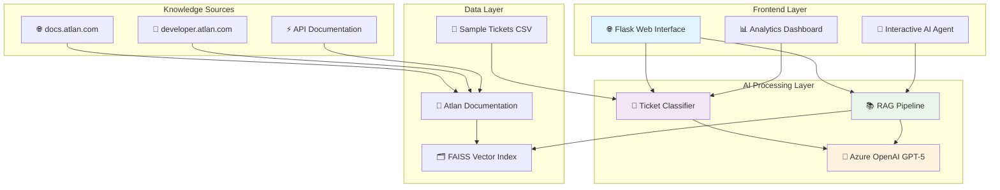
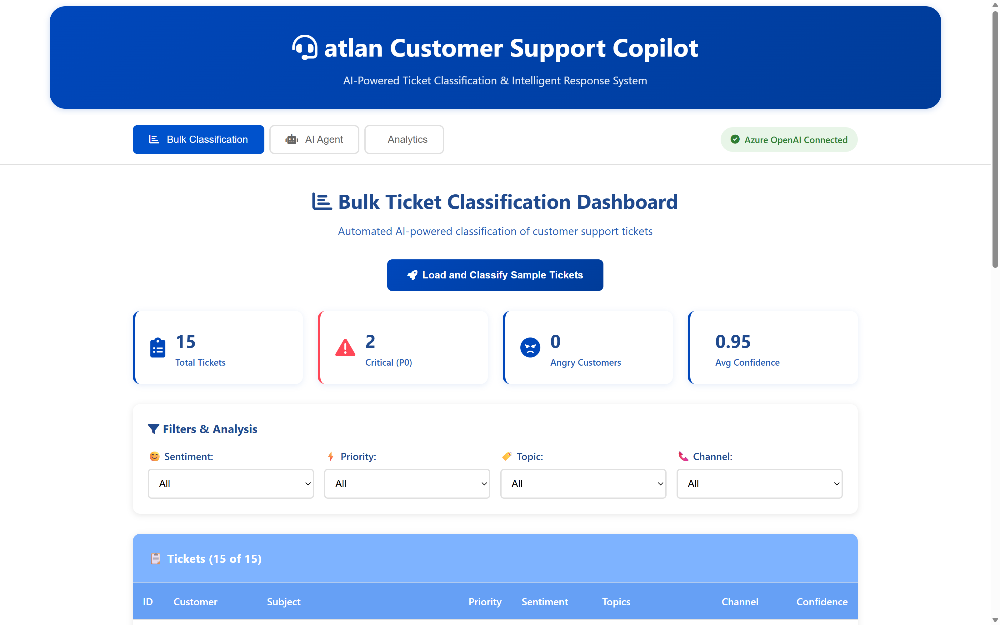
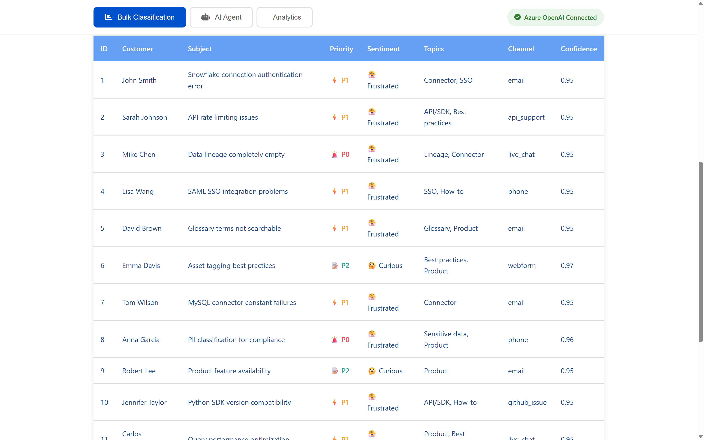
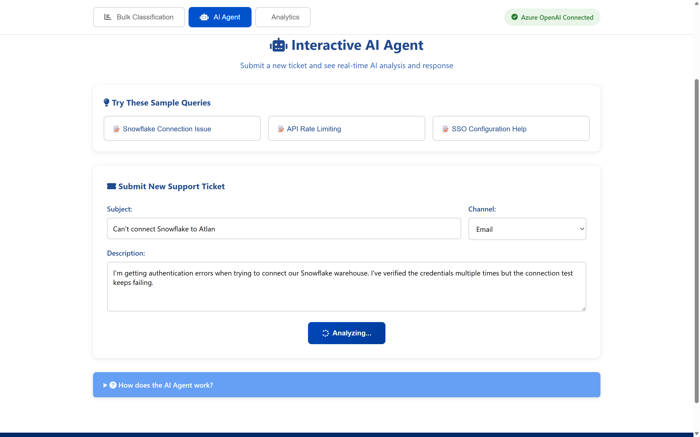
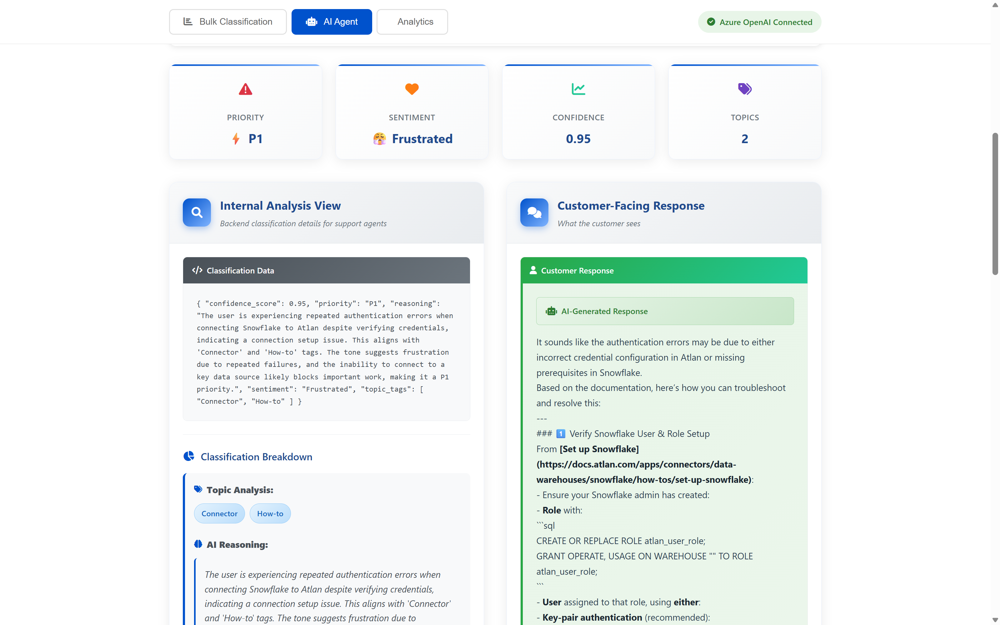
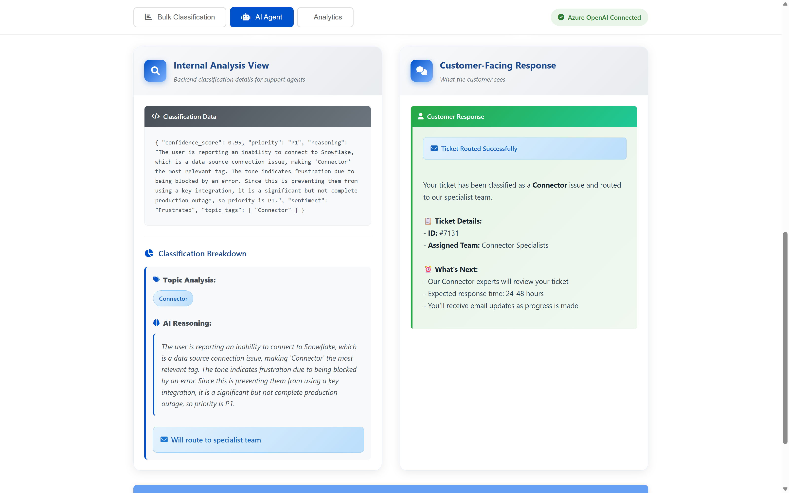
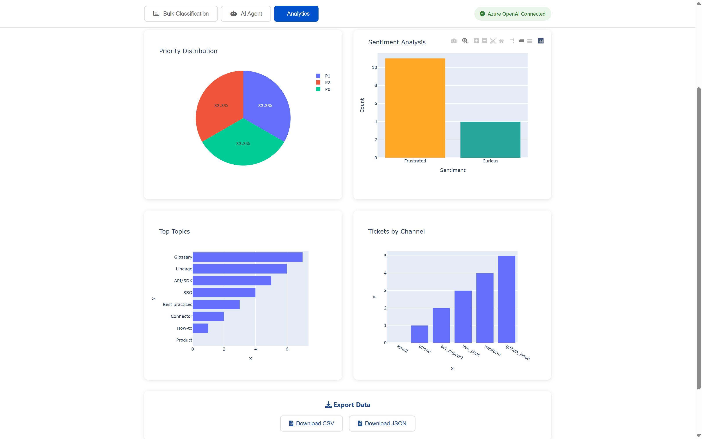

#  Atlan Customer Support Copilot

<div align="center">


**An AI-powered customer support system featuring automated ticket classification and intelligent response generation using RAG (Retrieval-Augmented Generation)**

[🚀 Quick Start](#quick-start) • [📊 Demo Screenshots](#demo-screenshots) • [🏗️ Architecture](#architecture) • [⚙️ Setup](#setup-instructions)

</div>

---

## 🎯 Problem Statement

Customer support teams face significant challenges in today's fast-paced environment:

- **⏱️ Manual Ticket Triage**: Time-consuming process of categorizing and prioritizing incoming tickets
- **📚 Knowledge Fragmentation**: Support agents need to search through multiple documentation sources
- **🔄 Inconsistent Responses**: Varying quality and accuracy of responses across different agents
- **📈 Scalability Issues**: Difficulty handling increasing ticket volumes efficiently

## ✨ Solution Overview

The Atlan Customer Support Copilot addresses these challenges through:

1. **🤖 Automated Classification**: Instantly categorizes tickets by topic, sentiment, and priority
2. **🎯 Intelligent Routing**: Automatically routes tickets to appropriate teams
3. **🧠 RAG-powered Responses**: Generates accurate answers using Atlan's official documentation
4. **📋 Consistent Experience**: Provides standardized, high-quality responses

---

## 🏗️ Architecture

<div align="center">



</div>

---

## 🚀 Key Features

### 📊 Bulk Ticket Classification Dashboard
- **Automated Processing**: Loads and processes tickets from CSV files
- **Multi-dimensional Classification**:
  - 🏷️ **Topic Tags**: How-to, Product, Connector, Lineage, API/SDK, SSO, Glossary, Best practices, Sensitive data
  - 😊 **Sentiment Analysis**: Frustrated, Curious, Angry, Neutral
  - ⚡ **Priority Levels**: P0 (urgent), P1 (high), P2 (medium/low)
- **Interactive Filtering**: Filter by sentiment, priority, and topic
- **Visual Analytics**: Charts and statistics for insights

### 🤖 Interactive AI Agent
- **Smart Input Processing**: Text input for new ticket submission
- **Dual View System**:
  - 🔍 **Internal Analysis**: Shows detailed classification JSON
  - 💬 **Customer Response**: Generates appropriate responses
- **Intelligent Routing**:
  - 📚 **RAG Responses** for: How-to, Product, Best practices, API/SDK, SSO
  - 🎯 **Routing Messages** for: Connector, Lineage, Glossary, Sensitive data
- **Source Citation**: All RAG-generated answers include source references

### 📈 Advanced Analytics
- **Real-time Metrics**: Ticket volume, confidence scores, priority distribution
- **Interactive Charts**: Sentiment analysis, topic distribution, channel breakdown
- **Export Capabilities**: CSV and JSON export options
- **Trend Analysis**: Historical data insights

---

## 📊 Demo Screenshots

<div align="center">

### 🏠 Main Dashboard


### 📋 Bulk Classification Results


### 🤖 Interactive AI Agent


### 📊 Analytics Dashboard


### 🎯 Classification Analysis


### 📈 Sentiment Analysis


</div>

---

## ⚙️ Setup Instructions

### 📋 Prerequisites

- **Python 3.8+**
- **Azure OpenAI Service** with GPT-5 deployment
- **Azure OpenAI API Key** and endpoint

### 🚀 Quick Start

1. **Clone the Repository**
   ```bash
   git clone <repository-url>
   cd atlan-support-copilot
   ```

2. **Install Dependencies**
   ```bash
   pip install -r requirements.txt
   ```

3. **Configure Environment**
   ```bash
   # Create .env file
   # Edit .env with your credentials
   AZURE_OPENAI_API_KEY=your_azure_openai_api_key_here
   AZURE_OPENAI_ENDPOINT=https://your-resource.openai.azure.com/
   AZURE_OPENAI_DEPLOYMENT=gpt-5-chat
   AZURE_OPENAI_API_VERSION=2025-01-01-preview
   ```

4. **Run the Application**
   ```bash
   python app.py
   ```

5. **Access the Application**
   - Open http://localhost:5000
   - Navigate between tabs: "Bulk Classification", "AI Agent", "Analytics"
   - Click "Load and Classify Sample Tickets" to see the dashboard

---

## 🧪 Testing the System

### 📝 Sample Queries

**How-to Questions:**
- "How do I connect Snowflake to Atlan?"
- "What are the steps to set up data lineage?"

**Product Questions:**
- "What features does Atlan offer for data governance?"
- "How does Atlan handle metadata management?"

**API/SDK Questions:**
- "How do I use the Python SDK to query assets?"
- "What are the rate limits for the Atlan API?"

### 🎯 Expected Behaviors

| Query Type | Response Type | Example Topics |
|------------|---------------|----------------|
| **RAG Response** | Direct answer with sources | How-to, Product, Best practices, API/SDK, SSO |
| **Routing Message** | Team routing notification | Connector, Lineage, Glossary, Sensitive data |

---

## 🏗️ Technical Architecture

### 🛠️ Technology Stack

| Component | Technology | Rationale |
|-----------|------------|-----------|
| **Frontend** | Flask + HTML/CSS/JS | Lightweight, fast development |
| **LLM Provider** | Azure OpenAI GPT-5 | Enterprise-grade, high performance |
| **Vector Database** | FAISS | Lightweight, no server needed |
| **Web Scraping** | BeautifulSoup + Requests | Simple, reliable crawling |
| **Data Processing** | Pandas | Efficient data manipulation |
| **Visualization** | Plotly | Interactive charts and graphs |

### 📁 Project Structure

```
atlan-support-copilot/
├── 📄 app.py                 # Main Flask application
├── 🎯 classifier.py          # Ticket classification logic
├── 📚 rag.py                # RAG pipeline implementation
├── 📊 sample_tickets.csv     # Sample ticket data
├── 📋 requirements.txt       # Python dependencies
├── 🔧 run.py                # Application runner
├── 📖 README.md             # Documentation
├── 🖼️ static/
│   ├── 📁 css/              # Stylesheets
│   ├── 📁 js/               # JavaScript files
│   └── 📁 images/           # Icons and screenshots
├── 🎨 templates/
│   └── 📄 index.html        # Main template
└── 🗂️ rag_index.*          # Generated FAISS index files
```

---

## 🔧 Configuration

### 🌐 Environment Variables

| Variable | Description | Required |
|----------|-------------|----------|
| `AZURE_OPENAI_API_KEY` | Azure OpenAI API key | ✅ |
| `AZURE_OPENAI_ENDPOINT` | Azure OpenAI endpoint URL | ✅ |
| `AZURE_OPENAI_DEPLOYMENT` | Deployment name | ✅ |
| `AZURE_OPENAI_API_VERSION` | API version | ✅ |

### 📊 Sample Data

The application includes `sample_tickets.csv` with realistic support tickets covering:
- **Authentication issues**
- **API rate limiting**
- **Data lineage problems**
- **SSO integration**
- **SDK compatibility**
- **Performance optimization**

---


## 🔮 Future Enhancements

### 🎯 Planned Features

- [ ] **Real-time Document Updates**: Scheduled re-crawling of documentation
- [ ] **Multi-modal Support**: Images, PDFs, and other file types
- [ ] **User Authentication**: Role-based access control
- [ ] **Performance Monitoring**: Metrics and alerting
- [ ] **A/B Testing**: Response quality optimization
- [ ] **Feedback Loop**: User rating system for continuous improvement

### 🛠️ Technical Improvements

- [ ] **Advanced Crawling**: Scrapy-based web scraping
- [ ] **Vector Database**: Migration to Pinecone/Weaviate
- [ ] **Caching Layer**: Redis for improved performance
- [ ] **API Rate Limiting**: Request throttling and queuing
- [ ] **Error Handling**: Comprehensive error management
- [ ] **Unit Tests**: Complete test coverage

---


<div align="center">

**Made with ❤️ for the Atlan Community**

[⬆️ Back to Top](#-atlan-customer-support-copilot)

</div>